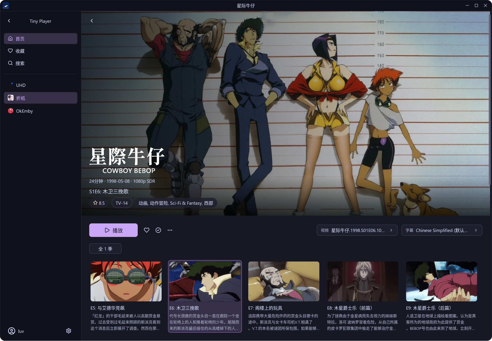
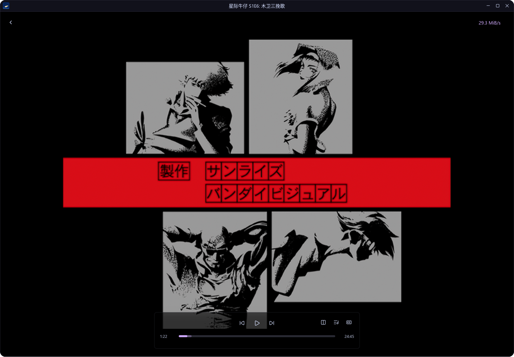

# Tiny Player

[English](README.md) | 简体中文

Tiny Player 是使用 Rust 和 GPUI 构建的原生 Emby 桌面客户端，面向 Linux 与 Windows。播放器使用 FFmpeg 解码，通过 Vulkan 和 libplacebo 完成视频渲染与色彩处理。

## 功能

- **多服务器管理**：添加、编辑和切换 Emby 服务器，显示服务器图标及媒体数量。
- **媒体库浏览**：电影与剧集海报、搜索、收藏、继续观看，以及季和单集选择。
- **影片详情**：展示影片 Logo、简介、评分、时长、上映日期、分辨率与动态范围信息。
- **播放与选轨**：选择视频版本、音轨和字幕，设置语言偏好，同步播放进度。
- **视频处理**：软件解码、Vulkan 硬件解码，以及 HDR 色调映射；硬解能力取决于显卡、驱动和视频编码。
- **播放体验**：全屏、倍速、字幕位置调整、播放信息面板，以及可配置的内存和磁盘缓存。

## 应用截图





## 系统要求

| 平台 | 运行要求 |
| --- | --- |
| Linux 预编译包 | x86_64 GNU/Linux，glibc 2.39 或更新版本，Wayland 或 X11 桌面会话 |
| Windows 便携包 | Windows 10 22H2 / Windows 11 x64，支持 Direct3D 11 的显卡与驱动 |
| 视频处理 | 可用的 Vulkan 显卡驱动；使用软件解码时，视频处理仍需要 Vulkan |

Linux 预编译包包含 FFmpeg、libplacebo 及部分依赖，系统还需提供 Vulkan loader、ALSA 及音频配置、Fontconfig、FreeType、字体、XKB 键盘数据、系统 CA 证书，以及与 Ubuntu 24.04（GCC 13）或更新版本兼容的 GCC/C++ 运行库。glibc 2.39 是预编译包的运行基线，其他方式构建时以构建环境和依赖要求为准。

Windows 便携包包含多媒体依赖与 Vulkan loader，显卡的 Vulkan 驱动由系统提供。运行便携包无需安装 Rust、Python、Visual Studio 或 FFmpeg。

## 安装

### Arch Linux

使用仓库中的 [PKGBUILD](PKGBUILD) 构建并安装：

```sh
sudo pacman -S --needed base-devel git
git clone https://github.com/Clwury/tiny-player.git
cd tiny-player
makepkg -si
```

`makepkg` 会安装声明的构建和运行依赖。安装后可从桌面应用菜单启动，也可运行：

```sh
tiny-player
```

### Linux 预编译包

适用于 **x86_64（64 位 Intel/AMD）GNU/Linux，要求 glibc 2.39 或更新版本**。前往 [GitHub 最新发布页](https://github.com/Clwury/tiny-player/releases/latest)下载 `tiny-player-<version>-linux-x86_64.tar.gz`。

解压完整归档后运行。请将 `<version>` 替换为所下载包的实际版本号：

```sh
tar -xzf "tiny-player-<version>-linux-x86_64.tar.gz"
./tiny-player/bin/tiny-player
```

也可安装到当前用户目录，无需 `sudo`：

```sh
./tiny-player/install.sh
```

安装位置固定为 `~/.local/tiny-player.app`，同时创建 `~/.local/bin/tiny-player` 启动链接和桌面菜单项。更新时关闭应用，将新版解压到新目录，再直接运行其中的安装脚本，无需传入参数。脚本自动替换应用、更新启动链接、桌面入口和图标，更新失败时恢复原安装，用户配置与缓存保留。

需要自行生成预编译包时，在 x86_64 Linux 主机上准备 Docker，并在仓库根目录运行：

```sh
./scripts/package-linux.sh
```

归档、校验文件和构建清单输出到 `dist/`。更多信息见 [Linux 打包说明](docs/linux-packaging.md)。

### Windows 便携包

适用于 **Windows 10 22H2 / Windows 11 x64（64 位 Intel/AMD）**。前往 [GitHub 最新发布页](https://github.com/Clwury/tiny-player/releases/latest)下载 `tiny-player-<version>-windows-x86_64.zip`。

完整解压 `tiny-player-<version>-windows-x86_64.zip`（`<version>` 为所下载包的实际版本号），双击目录中的 `tiny-player.exe`。移动应用时保留整个目录，包括 DLL 和 `share/` 资源。配置与缓存保存在 Windows 用户目录中。

自行构建需要 Rust MSVC 工具链、Visual Studio 2022 C++ x64 Build Tools、Windows SDK，以及 64 位 Python 3.12。在仓库根目录的 PowerShell 中运行：

```powershell
.\scripts\package-windows.ps1
```

脚本准备原生依赖并生成 `dist/` 下的应用目录与 ZIP。详细环境准备、离线构建与检查方法见 [Windows 打包说明](docs/windows-packaging.md)。

### 从源码运行

工作空间包含根包 `tiny-player` 应用和 [`tiny-playback` 播放引擎](crates/tiny-playback)。
引擎不依赖 GPUI，通过普通 Rust 类型输出视频与字幕像素；GPUI 图像适配留在应用中。
播放页面与 Emby 集成保留在应用中，模块归属与构建细节见[播放引擎边界](docs/playback-engine.md)。
运行 `cargo test --workspace --locked` 测试两个 crate，或使用
`cargo test -p tiny-playback --locked` 单独测试引擎。

克隆仓库后，Linux 开发环境需要：

- Rust stable、C/C++ 构建工具、Clang/libclang、pkg-config。
- FFmpeg 8.1 或 9.x、libplacebo 7.x，以及相应的开发头文件。
- Vulkan 头文件、loader 和显卡驱动，以及 ALSA、Wayland/X11 等依赖，完整列表见 [PKGBUILD](PKGBUILD)。

在仓库根目录运行：

```sh
cargo run --locked
```

构建优化版本：

```sh
cargo build --release --locked
./target/release/tiny-player
```

Windows 开发环境在满足上述 Windows 构建条件后，先准备依赖与本地 Cargo 配置：

```powershell
.\scripts\package-windows.ps1 -Mode Prepare
cargo run --locked
```

## 播放操作与快捷键

以下快捷键在播放页面获得键盘焦点时生效：

| 按键 | 操作 |
| --- | --- |
| `Space` / `P` | 播放 / 暂停 |
| `F` | 切换全屏 |
| `Esc` | 优先关闭已展开的选集列表，否则退出全屏 |
| `←` / `→` | 后退 / 前进 5 秒 |
| `↓` / `↑` | 后退 / 前进 60 秒 |
| `9` / `/` | 音量降低 2 个百分点 |
| `0` / `*` | 音量提高 2 个百分点 |
| `M` | 静音 / 取消静音 |
| `[` | 播放速度除以 1.1 |
| `]` | 播放速度乘以 1.1 |
| `{` / `}` | 播放速度减半 / 加倍（通常为 `Shift` + `[` / `]`） |
| `Backspace` | 恢复 1 倍速 |
| `R` / `T` | 上移 / 下移字幕，每次为视频显示高度的 1% |
| `I` | 显示 / 隐藏播放信息面板 |

倍速范围为 **0.25–4 倍**。音量快捷键也支持数字小键盘的除号与乘号；持续按住音量或倍速调整键可重复调整。方向键按每次按下触发跳转。

播放画面上的鼠标操作：

| 操作 | 效果 |
| --- | --- |
| 左键双击画面 | 切换全屏 |
| 右键单击画面 | 播放 / 暂停 |
| 滚轮上 / 下滚动 | 提高 / 降低音量 |
| 点击或拖动进度条 | 跳转到指定播放位置 |

## License

本项目采用 **GNU General Public License v3.0 或更新版本（GPL-3.0-or-later）**，完整条款见 [LICENSE](LICENSE)。第三方依赖遵循各自的许可证。

## 致谢

感谢以下项目与应用提供的基础能力、实现参考和设计启发：

- [Zed / GPUI](https://github.com/zed-industries/zed)
- [gpui-kit](https://github.com/longbridge/gpui-kit)
- [Tsukimi](https://github.com/tsukinaha/tsukimi)
- [mpv](https://github.com/mpv-player/mpv)
- [Lenna](https://lennaapp.github.io/)

图标来源于 [离歌图标库（lige47/lige_icon）](https://github.com/lige47/lige_icon)
